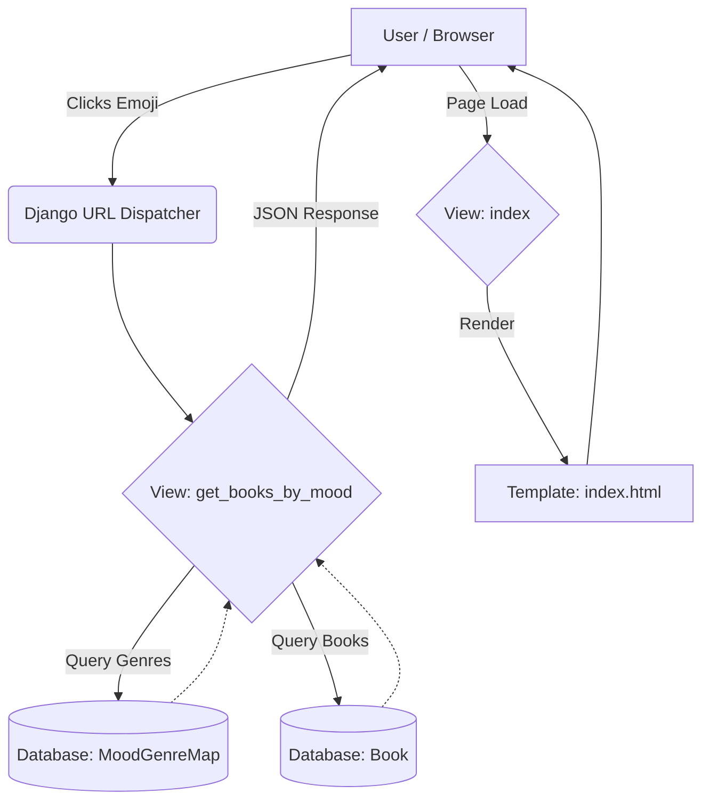

# MoodShelf - Interview Preparation Guide

This document provides a comprehensive overview of the **MoodShelf** project to help you explain it confidently during technical interviews. It covers the problem statement, architecture, technical details, and potential interview questions.

---

## 1. Project Overview (The "Elevator Pitch")

**Name:** MoodShelf  
**Tagline:** "Find books that match your vibe."

**Description:**  
MoodShelf is a web application that recommends books based on the user's current emotional state. Unlike traditional recommendation systems that rely on past purchase history or collaborative filtering, MoodShelf focuses on the user's *present* context (mood). Users select their mood via an interactive emoji interface (Happy, Sad, Bored, etc.), and the system filters a curated library of books mapped to corresponding genres.

**Target Audience:**  
Book lovers who are unsure what to read next and want a recommendation that fits their current feeling.

---

## 2. Technical Stack

| Component | Technology | Description |
| :--- | :--- | :--- |
| **Backend** | **Python (Django 5.2)** | robust web framework handling routing, ORM, and auth. |
| **Database** | **MySQL** | Relational database to store Users, Books, Moods, and logs. |
| **Frontend** | **HTML5, CSS3, JavaScript** | Custom UI with **Glassmorphism** design, **Bootstrap 5.3** for responsiveness. |
| **Templating** | **Django Templates (Jinja-like)** | Server-side rendering for HTML construction. |
| **Styling** | **Custom CSS + FontAwesome** | Animations, gradients, and custom emoji tiles. |

---

## 3. System Architecture & Database Design

### Architecture Pattern: MVT (Model-View-Template)
*   **Model:** Defines the data structure (Mood, Book, User).
*   **View:** Handles business logic (fetching books by mood, logging users).
*   **Template:** The presentation layer (`.html` files) shown to the user.

### Database Schema (ER Diagram Logic)
Explain that the database is normalized to standard forms:
1.  **Users:** Standard Django User model (handles auth).
2.  **Mood:** simple lookup table (`name`, `emoji`).
3.  **Book:** Stores metadata (`title`, `author`, `genre`, `description`, `image_url`).
4.  **MoodGenreMap:** **Crucial Table**. It acts as a bridge.
    *   *Why?* A mood like "Happy" might map to "Comedy" and "Adventure". This table allows flexible Many-to-Many mapping between emotional states and literary genres.
5.  **Favorite:** Links `User` and `Book` (Many-to-Many) to save likes.
6.  **MoodLog:** Tracks user history (`User`, `Mood`, `Timestamp`) to show "How you felt over time" on the profile page.

---

## 4. Key Features & Implementation Details

### A. Mood-Based Recommendation Engine
*   **How it works:**
    1.  User clicks an emoji (e.g., "Sad").
    2.  Frontend sends an AJAX/Fetch request to `/get-books-by-mood/?mood_id=X`.
    3.  Backend looks up mapped genres in `MoodGenreMap`.
    4.  Backend queries the `Book` table: `SELECT * FROM books WHERE genre IN (...)`.
    5.  Returns a JSON list of books to the frontend to display dynamically.

### B. User Authentication & Engagement
*   **Auth:** Standard Django Login/Register views.
*   **Email:** Sends a welcome email via SMTP (Gmail) upon successful registration.
*   **Profile:** Displays a user's `MoodLog` history—a personalized touch showing their emotional journey.

### C. Interactive UI (The "Wow" Factor)
*   **Glassmorphism:** Use of semi-transparent backgrounds with blur (`backdrop-filter: blur(16px)`).
*   **Audio Feedback:** JavaScript integration plays `hover.mp3` and `clickme.mp3` to make the UI feel tactile and responsive.
*   **Animations:** CSS Keyframes for bouncing emojis and glowing text.

---

## 5. Potential Interview Questions

### Q1: Why did you choose this logic for recommendations?
**Answer:** "I wanted to solve the 'Analysis Paralysis' problem. Instead of complex collaborative filtering (A/B testing), I used a **Rule-Based System** (Mood -> Genre) which is effective for a cold-start problem where we don't have massive user data yet. It provides immediate value."

### Q2: How would you scale this?
**Answer:**
*   **Database:** Add indexing on `genre` columns for faster lookups.
*   **Caching:** Use Redis to cache the results of popular moods (e.g., "Happy" books don't change often).
*   **External Data:** Move from a local database of books to an external API like **Google Books API** or **OpenLibrary** to offer millions of books instead of hundreds.

### Q3: What was the hardest part?
**Answer:** "Designing the Mood-to-Genre mapping. Subjectivity is hard to code. 'Sad' for one person means they want a 'Comedy' to cheer up; for another, they want a 'Tragedy' to wallow. I solved this by allowing multiple genres per mood, but in the future, I would add user preference settings."

### Q4: How is security handled?
**Answer:**
*   **CSRF Protection:** Django's built-in middleware prevents Cross-Site Request Forgery.
*   **SQL Injection:** Django ORM handles query parameterization automatically.
*   **Passwords:** Hashed and salted using PBKDF2 (Django default).

---

## 6. Future Improvements (Roadmap)
1.  **AI Integration:** Use NLP (Natural Language Processing) to analyze book descriptions and match them to moods dynamically, rather than hardcoded genres.
2.  **Social Features:** Share your "Mood of the day" and book pick on social media.
3.  **Deployment:** Deploy to platform services like **Railway** or **Render** for public access.

